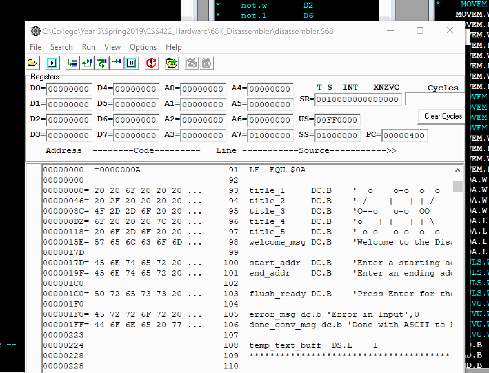

# Motorola 68K Disassembler  

**The code for this project has been hidden seperately to prevent academic dishonesty.**

We created a disassembler for the Motorola 68000 microprocessor using assembly language. The purpose of this project is aquiring a deep understanding of 68K assembly and working with input at the bit level. Additionally, learn to get a feel of starting and finishing a large scale software project, understanding time management, and software stress testing.  

## Opcodes
**Required Opcodes to Decode:**

|   |   |   |   |   |
|---|---|---|---|---|
| NOP | ADD | AND | ASR | JSR |
| MOVE | ADDA | OR | ASL | RTS |
| MOVEA | ADDQ | NOT | BGT | BRA |
| MOVEQ | SUB | LSL | BLE | ROL |
| MOVEM | LEA | LSR | BEQ | ROR |

#### Opcode Bit Details
  

### How to Run the Disassembler

The following gif shows the process of how to run the disassembler program. Before this, be sure to load an `.L68` file into memory in order to start the decoding process.

## Effective Address Modes
**Effective Addressing Modes:**
* Data Register Direct
* Address Register Direct
* Address Register Indirect
* Immediate Data
* Address Register Indirect with Post incrementing
* Address Register Indirect with Pre decrementing
* Absolute Long Address
* Absolute Word Address

## Testing
The disassembler was tested by adding a test file loaded to a specified location in memory depending where the test file was ORG'd. Our personal testing file is provided for your convenience.
